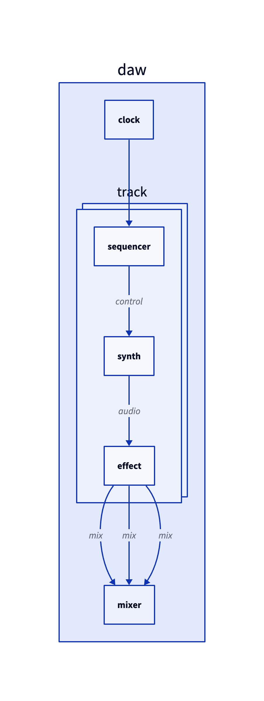
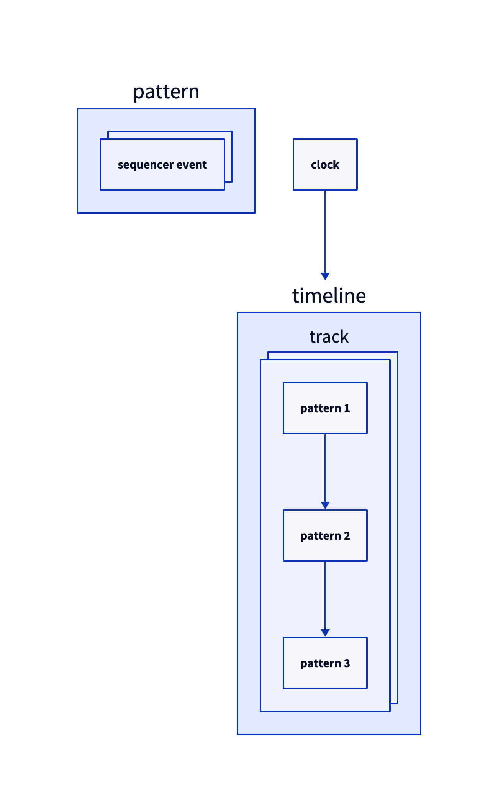

# Concept

## Sequencer

* Multiple types
  * Piano roll
  * Generative
  * Step sequencer
* Pattern-based
  * Patterns placed on timeline, rather than timeline being one big piano roll
* No automation?

## Synth

* "Drum synth"
* FM synth
* Analog synth

## Effects

* Reverb

## Diagrams

